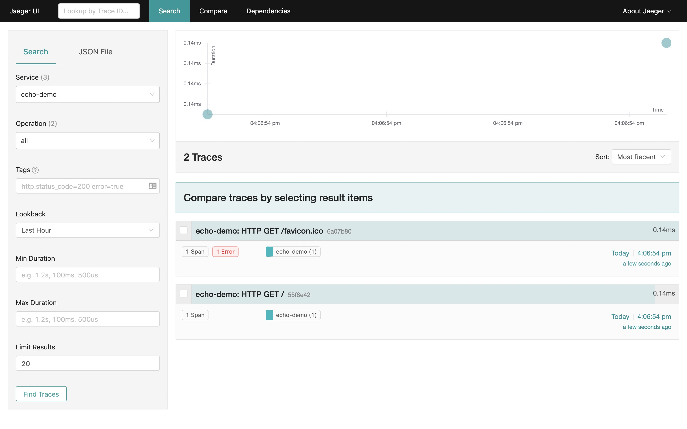

# echo
a middleware for the echov4 web framework to use opentracing

```go
package main

import (
	"github.com/labstack/echo/v4"
	apmecho "github.com/opentracing-contrib/echo"
	"github.com/opentracing-contrib/echo/examples/tracer"
	"github.com/opentracing/opentracing-go"
	"net/http"
	"os"
)

const (
	DefaultComponentName = "echo-demo"
)

func main() {

	flag := os.Getenv("JAEGER_ENABLED")
	if flag == "true" {
		// 1. init tracer
		tracer, closer := tracer.Init(DefaultComponentName)
		if closer != nil {
			defer closer.Close()
		}
		// 2. ste the global tracer
		if tracer != nil {
			opentracing.SetGlobalTracer(tracer)
		}
	}

	e := echo.New()

	if flag == "true" {
		// 3. use the middleware
		e.Use(apmecho.Middleware(opentracing.GlobalTracer(),
			apmecho.ComponentName(DefaultComponentName)))
	}

	e.GET("/", func(c echo.Context) error {
		return c.String(http.StatusOK, "Hello, World!")
	})

	e.Logger.Fatal(e.Start(":1323"))
}

```

Example: [echo-example](./examples)




